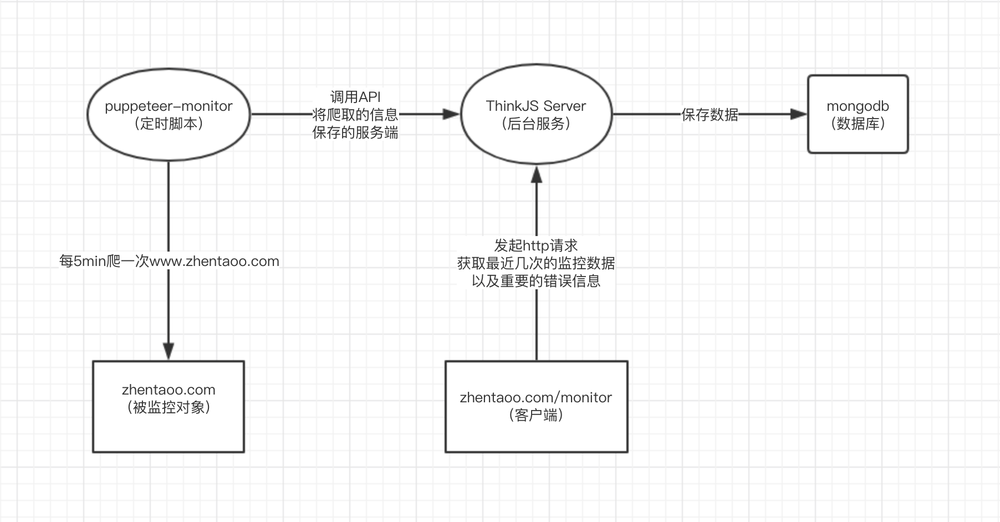
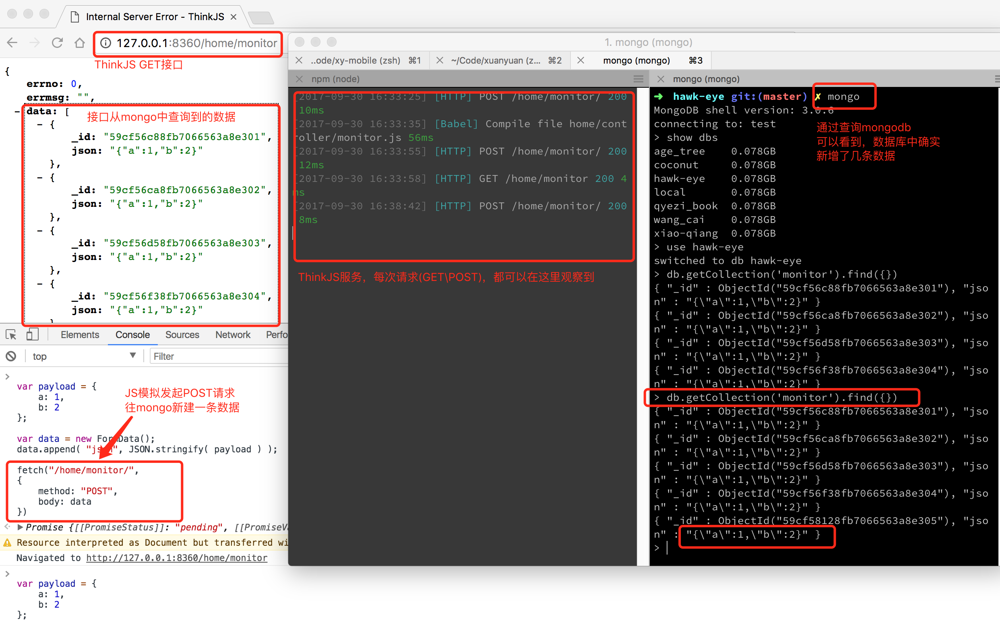

## hawk-eye, 前端监控系统，PuppeteerJS ＋ ThinkJS
- 目前市面上以及各大公司使用的监控系统，几乎都是API层监控，包括调用量、数据、响应时长.....
- 似乎只要接口没问题，整个系统就是稳定运行的，一切皆大欢喜
- 但事实并非如此，CDN、DNS、Webview等等这些条件，都可能导致前端渲染失败、白屏
- 本项目的小型监控系统，贴近用户，直接抓取站点表现形式

## 监控系统，整体思路
- 通过Puppeteer，定时爬取被监控站点，如果有异常则保存截图
- 创建一个后台Server，为定时脚本提供API，记录成功or失败的情况
- server提供api，可以查询所有的监控记录

## Usage
1. npm i
2. npm start

## PuppeteerJS: 定时脚本，爬取被监控对象的状态
`/scripts/monitor-pp.js`

## ThinkJS: 简单的后台服务
- 使用ThinkJS创建一个简单的RestFUl APi
- 文档： https://thinkjs.org/zh-cn/doc/3.0/rest.html#toc-b15
- 安装2.0脚手架：`npm install -g thinkjs@2`
- 初始化项目：`thinkjs new hawk-eye`
- 创建restful api：`thinkjs controller home/monitor -r`

